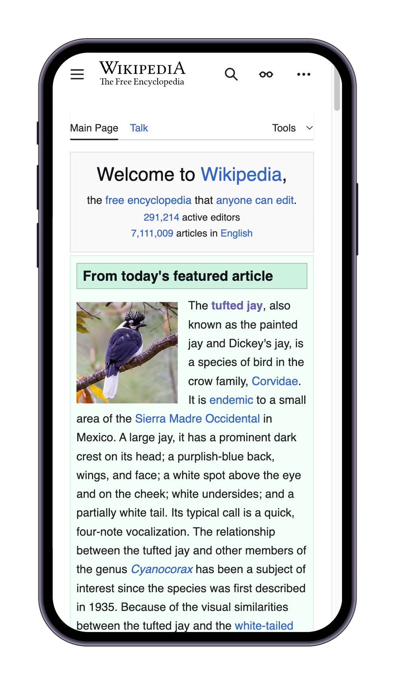

# Svelte Device Frame

Svelte implementation of [DevicesCSS](https://devicescss.xyz/) frames.

## Demo


## Usage

```typescript
<script lang="ts">
	import Frame from 'svelte-deviceframe';
</script>

<Frame deviceType="phone-generic" deviceColor="spacegray" class="m-10 mx-auto">
	<iframe
		class="h-200 w-100 border-none"
		src="https://en.wikipedia.org/wiki/Main_Page"
		title="Device preview"
	></iframe>
</Frame>
```